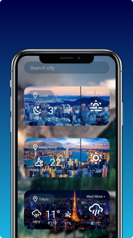

## A simple Weather App
This is a simple Weather App using [my own API](https://github.com/Pierrelouisdelx/Weather-API). The purpose of this app was for me to learn react native.



## Prerequisites
* React Native

Please refer to the official documentation

---

### Usage :
```
npx react-native start
```
Android :
```
npx react-native run-android
```

IOS :
```
npx react-native run-ios
```

